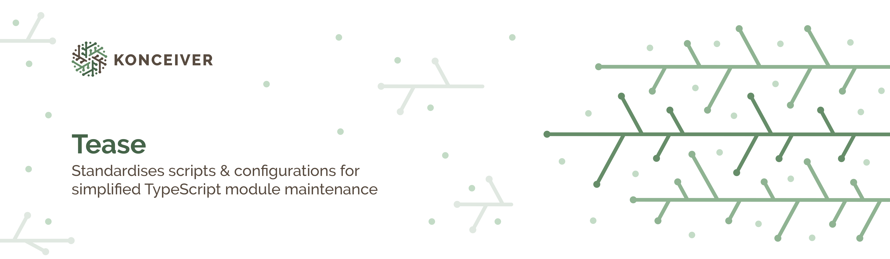

# @konceiver/tease

<p align="center"></p>

[](https://npmjs.com/package/@konceiver/tease)
[](https://npmjs.com/package/@konceiver/tease)
[](https://github.com/konceiver/tease/actions?query=workflow%3Arun-tests+branch%3Amaster)
[](https://npmjs.com/package/@konceiver/tease)

This package was created by, and is maintained by [Brian Faust](https://github.com/faustbrian), and provides standardises scripts & configurations for simplified TypeScript module maintenance.

> This project is based on [borderless/ts-scripts](https://github.com/borderless/ts-scripts) and has been altered to match our configurations and preferences. Consider sponsoring [Blake Embrey](https://github.com/sponsors/blakeembrey) if you find his packages useful.

## Installation

```bash
npm install @konceiver/tease
```

## Usage

In your `package.json` you can use the scripts:

```json
{
	"scripts": {
		"lint": "tease lint",
		"format": "tease format",
		"specs": "tease specs",
		"test": "tease test",
		"prepare": "tease install && tease build"
	}
}
```

## Testing

```bash
npm run test
```

## Changelog

Please see [CHANGELOG](CHANGELOG.md) for more information on what has changed recently.

## Contributing

Please see [CONTRIBUTING](CONTRIBUTING.md) for details.

## Security

If you discover a security vulnerability within this package, please send an e-mail to security@konceiver.dev. All security vulnerabilities will be promptly addressed.

## Credits

This project exists thanks to all the people who [contribute](../../contributors).

## License

tease is an open-sourced software licensed under the [MIT](LICENSE.md).
